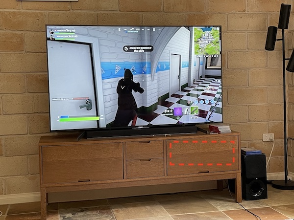
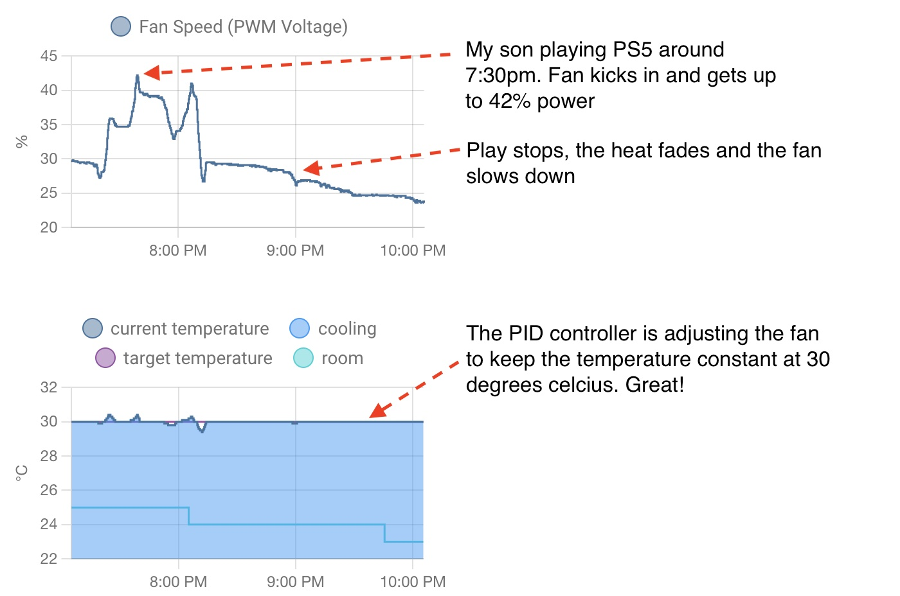
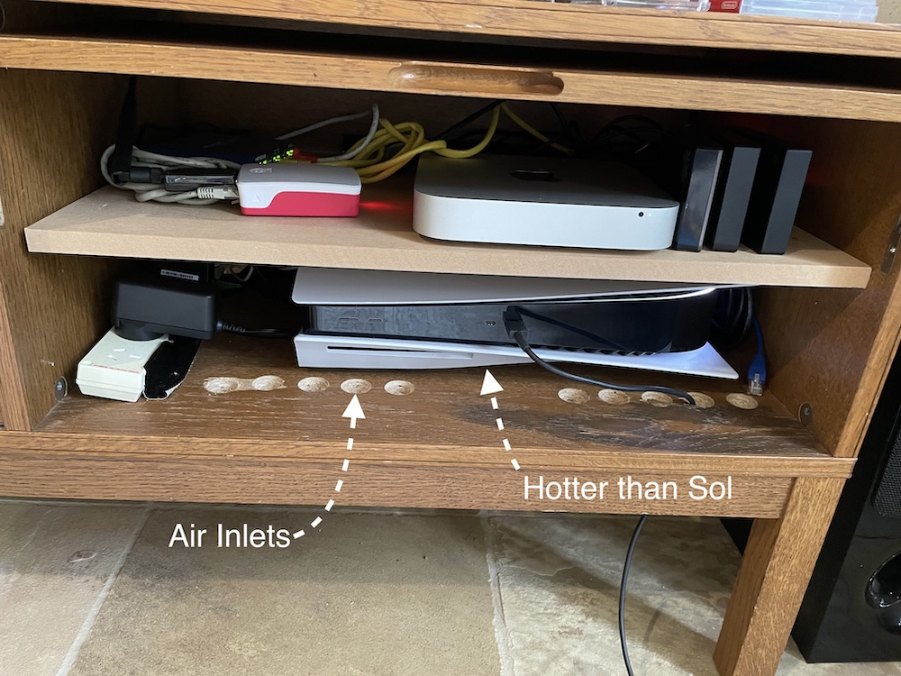
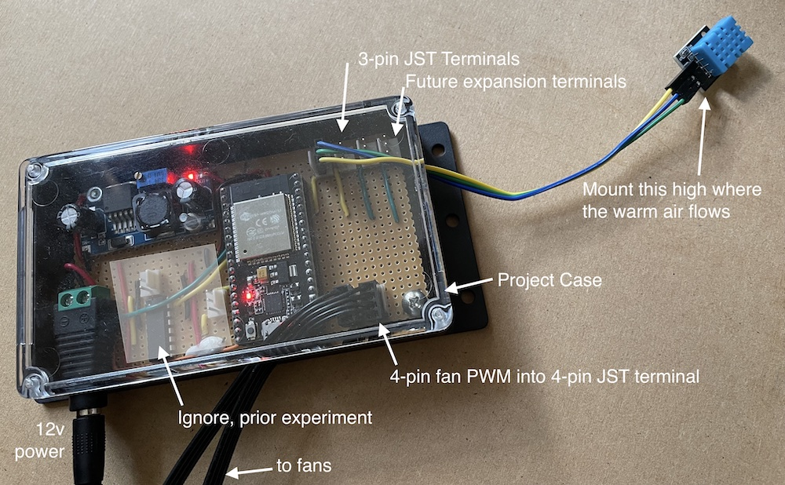
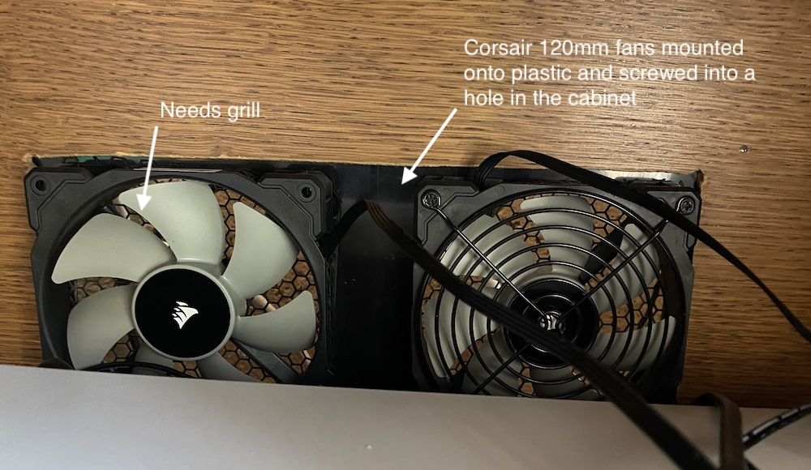
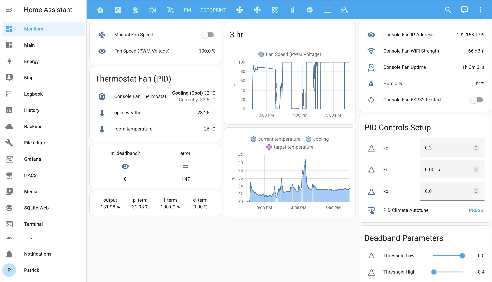

# ESPHome Fan Controller

This project describes how to build a quiet thermostat controlled fan for cooling your media console, gaming cupboard or anything else.

The software is ESPHome and Home Assistant. The hardware is an ESP32 with a regular 12v 120mm Computer Fan (PWM) and a Temperature Sensor (DHT11).

## Cost
The electronic parts are $29 USD including the ESP32. 

## Motivation
My sons's Playstation 5 sits in our TV Console which runs hotter than Sol. Also in that Media Console is a Macmini, a Raspberry Pi and a few other devices. My wife likes to keep the door neat and closed, so it needs some cooling!

I previously had a thermostat which simply toggled the fan on or off if it got too hot. That didn't work for me. Instead, this is a smart thermostat which intelligently controls the 12v-fan speed in order to maintain a perfect temperature in your cabinet. It will hold the fan at the necessary power level (like 22% power) to keep a cupboard cool rather than cycle the fan between 0% and 100% power constantly making wife-unfriendly noise. There is nothing worse than watching a movie and hearing the fan power on at 100% every minute.



## Features
The main features are:

- the **fan dynamically adjusts** it's speed based on the temperature sensor using a Process Control mechanism called PID
- **adjustable target temperature**. I currently target 30degC but maybe in winter I'll reduce it to 27.
- uses ESP32's Wifi to connect to Home Assistant for control and reporting
- the ESP32 is standalone and so the cooling function will continue to operate without Wifi. Doesn't need HomeAssistant or Wifi to operate. Wifi is only needed for setup, manual control and reporting.
- **no screen** is needed on the device itself, all management is done via Home Assistant
- my system uses two fans for extra cooling. Depending on how much air you need to draw through your enclosed space you could use 1 or 2 fans
- it is easily extendable to control up to 10 separate enclosed spaces with separate temperature sensors as well. You're only limited by the Amps of your 12v Power Brick and the pins on your ESP32.
- **no coding is needed**. Just some configuration in YAML files. In fact this repo only contains 1 file ``config-fan.yaml``.
- **No resistors, capacitors or difficult soldering needed**. The fan and the temperature sensor plug straight onto the pins of the ESP32. Although I did mount mine on a perfboard for cleanliness and put it in a case.



This is a screenshot from Home Assistant. I'll show you how to setup this dashboard.

## Visuals





## Parts (~$29 USD)

- **DHT11** - temperature and humidity sensor. I'm using the one on a board with 3-pins. Cost $1.50 USD<br>

- **12v PWM 4-pin Computer Fan** - I'm using 2 x [120mm Corsair fans](https://www.corsair.com/us/en/Categories/Products/Fans/Magnetic-Levitation-Fans/ml-config/p/CO-9050039-WW). Any 12v PWM-controllable fan should work. Cost $8-$15 USD. I recommend getting high quality fans if you care about noise and need to move a lot of air<br>. 

- **12v Power Adapter** - 1A or 2A should be fine depending on your fan's current draw. Cost $7 <br> 

- **12v DC Female Jack** - with wire outlets. You can normally buy these with the Power Adapter<br> or  

- **LM2596 Buck Converter** - to convert 12v down to 3.3v. Cost $1.50 each (normally in packs of 6-10)<br> 

- **ESP32**. You can use any ESP32. I'm using a NodeMCU compatible board. Mine cost $4 from Aliexpress<br> 

## Choosing a Good Fan
As you'll see below, our fans are being powered by the PWM pin. Our expectation is that the fans stop spinning at 0% power. Some people have reported that some fans don't stop running at 0% power (or worse that they stop completely at 100% power which is weird). 

It appears that Corsair and Noctua fans behave as expected so you might want to stick with them.

However, if your fan does behave this way, you can use a MOSFET like the FQP30N06L to add an on/off switch to another GPIO pin to completely cut the power when the PWM output is at 0%. If you need a schematic, please [post an issue](https://github.com/patrickcollins12/esphome-fan-controller/issues/new) and we can help out.

## Wiring Diagram


Some important notes:
- connect the fan PWM pin to a PWM GPIO
- turn the knob on the buck converter with a screwdriver to make it output exactly 3.3v. You'll need a multimeter to measure that output.
- ensure the 12v and 3.3v grounds are connected together.
- the unused pin on the fan is the "Tach" pin. This could tell you the RPM of the fan. We won't use this instead opting to measure the input voltage we're sending to the fan.
- you could easily skip the Buck converter and use two power sources 3.3v and 12v. 
- the fritzing diagram shows a 4-pin DHT-11, when in fact I have the simpler 3-pin version as shown in the parts list. The 4-pin version might need a pullup resistor, haven't tried it.

## Installing the software onto the ESP32

### Get this repo
Clone this github repository.
From the command line cd into the directory

### Review the YAML and read the ESPHome docs.

Review the YAML file.

Ensure the pins are set correctly for the PWM Fan (ledc) and the DHT-11.

Review the instructions for [the ESPHome Climate Thermostat](https://esphome.io/components/climate/index.html), [ESPHome PID Climate Thermostat](https://esphome.io/components/climate/pid.html) and the [DHT-11 sensor](https://esphome.io/components/sensor/dht.html).

Change the device name from ``console-fan`` to whatever seems appropriate. You might want to change the yaml filename as well.

Set the correct pin for your temp sensor. Note that the DHT11 sensor is setup to use an exponential moving average. Without this filter the PID controller reacts to every minor sensor movement. If you have a faster sensor like the BME260 you might need to tweak this filter.

```yaml
  # GET TEMP/HUMIDITY FROM DHT11
  - platform: dht
    pin: GPIO33
    temperature:
      name: "Temperature"
      id: console_fan_temperature
      accuracy_decimals: 3

      # If you don't smooth the temperature readings 
      # the PID controller over reacts to small changes.
      filters:
         - exponential_moving_average:  
             alpha: 0.1
             send_every: 1

```

Also note that my fans stop working below 13% power, so I set that is the minimum. I have a max power of 80% applied to the fans to minimise the wife-unfriendly noise. You might want to remove this minimum or maximum. Make sure you connect your fan to a PWM capable GPIO. All ESP32 pins that can act as outputs can be used as PWM pins but GPIOs 34-39 can’t generate PWM.

```yaml
  - platform: ledc
    id: console_heat_speed
    pin: GPIO27

    # 25KHz is standard PWM PC fan frequency, minimises buzzing
    frequency: "25000 Hz"

    min_power: 13%
    max_power: 80%

```

### Setup your wifi details

``mv secrets-sample.yaml secrets.yaml``

Edit your wifi credentials in secrets.yaml. The .gitignore will prevent you accidentally uploading your wifi credentials to github.

### Install ESPHome

[Install ESPHome](https://esphome.io/guides/installing_esphome.html) according to the instructions on the ESPHome website.

I prefer command-line on Mac:
``pip3 install esphome``

You could use the ESPHome that runs inside Home Assistant. 

### Install to ESP32

Connect your ESP32 via USB to your computer, then upload the Firmware to the ESP32.

`` esphome run console-fan.yaml``

At this time if you've set the pins right, the sensor should be spitting out values and the PID can control the fan.

Success! 

```
% esphome logs console-fan.yaml
INFO Reading configuration console-fan.yaml...
INFO Starting log output from console-fan.local using esphome API
INFO Successfully connected to console-fan.local
...
[22:54:09][C][mdns:085]:   Hostname: console-fan
[22:54:09][C][homeassistant.text_sensor:023]: Homeassistant Text Sensor 'ha_kp'
[22:54:09][C][homeassistant.text_sensor:024]:   Entity ID: 'input_text.kp'
[22:54:10][C][homeassistant.text_sensor:023]: Homeassistant Text Sensor 'ha_ki'
[22:54:10][C][homeassistant.text_sensor:024]:   Entity ID: 'input_text.ki'
[22:54:10][C][homeassistant.text_sensor:023]: Homeassistant Text Sensor 'ha_kd'
[22:54:10][C][homeassistant.text_sensor:024]:   Entity ID: 'input_text.kd'
[22:54:10][D][dht:048]: Got Temperature=30.0°C Humidity=38.0%
[22:54:10][D][sensor:113]: 'Humidity': Sending state 38.00000 % with 0 decimals of accuracy
[22:54:11][D][dht:048]: Got Temperature=30.0°C Humidity=38.0%
[22:54:11][D][sensor:113]: 'Humidity': Sending state 38.00000 % with 0 decimals of accuracy
[22:54:12][D][dht:048]: Got Temperature=30.0°C Humidity=38.0%
[22:54:12][D][sensor:113]: 'Humidity': Sending state 38.00000 % with 0 decimals of accuracy
```

## Setup Home Assistant

If the above steps worked correctly, the device will be auto-discovered by Home Assistant. You will need to add the device.

Multiple sensors and switches are exposed by the ESPHome software.

You also need to setup the dashboard. I'll explain those two steps below.

## Setting up the Home Assistant Dashboard



Here is my full dashboard in Home Assistant.

Let's go through them section by section.

### The Primary Controls


By clicking the thermostat you can turn on/off the thermostat and fan and adjust the target temperature which will be persisted to flash on the ESP32.

```yaml
type: entities
title: Console Fan
entities:
  - entity: sensor.fan_speed_pwm_voltage
  - entity: climate.console_fan_thermostat
  - entity: sensor.contact_sensor_1_temperature
    name: Room Temperature
  - entity: sensor.openweathermap_temperature
    name: Outside temperature
  - entity: number.console_fan_kp
  - entity: number.console_fan_ki
  - entity: number.console_fan_kd
  ```

- The ``Fan Speed (PWM Voltage)`` is the % of voltage being sent out via PWM to the fan controller. At 100% it will be sending 12v, at 50% it will be sending 6v.

- The ``Console Fan Thermostat`` is a controllable thermostat, by clicking it you can alter the target temperature and turn the fan on/off.

- The Room and Outside temperatures are from other sensors in my house for reference.

- The ``kp, ki and kd`` inputs are exposed from the device. Your ESP32 will be automatically receiving changes to these values to control the behavior of the PID controller. While you could tune these from the config.yaml it requires a compile, upload and reboot cycle each time. This is inconvenient and best to tweak in real-time. We want to expose these 3 parameters to a Home Assistant dashboard.

### The Graphs


Add the fan speed and the thermostat to two separate graphs. I've also added my room temperature from a separate device for comparison.

```yaml
type: vertical-stack
title: 3 hr
cards:
  - type: history-graph
    entities:
      - entity: sensor.fan_speed_pwm_voltage
    hours_to_show: 3
    refresh_interval: 0
  - type: history-graph
    entities:
      - entity: climate.console_fan_thermostat
        name: ' '
      - entity: sensor.contact_sensor_1_temperature
        name: room
    hours_to_show: 3
    refresh_interval: 0
```

### Helpful Details - More Sensors and Switches


This dashboard YAML exposes various sensors and switches from the ESP32.

```yaml
type: entities
entities:
  - entity: sensor.console_fan_ip_address
  - entity: sensor.console_fan_wifi_strength
  - entity: sensor.console_fan_uptime
  - entity: sensor.humidity
    name: console fan humidity
  - entity: switch.console_fan_autotune
  - entity: switch.console_fan_esp32_restart
```

- ``console_fan_autotune`` is a button which starts the [PID tuning](https://esphome.io/components/climate/pid.html#autotuning) process. I ended up abandoning this approach and manually tuning the PID.

- ``console_fan_esp32_restart`` restarts the ESP32 remotely.

## Configuring the PID Parameters

The thermostat is controlled using a standard Process Control system called a PID. 

In our system the goal of the PID control is to set the fan voltage (speed) to bring the temperature measured by the sensor to a target temperature (30degC).

Search the internet and you'll find many resources for setting up a PID Controller. There are a lot of resources for fast response systems like cruise control systems but not many for dealing with slow response cooling systems like this one.

The [ESPHome PID Climate](https://esphome.io/components/climate/pid.html) system that we're using here has some resources to explain how to tune the parameters. However, its autotune system didn't spit out useful results for me and I will explain how to manually get the right parameters. Your system will be different to mine and so your parameters will need to be slightly different. For instance, your cabinet will be a different size, I have two fans, you may only have one, etc.

There are only two parameters you will need to adjust: the kp and ki parameters. The kd parameter is not useful for us.

In my system the goal of tuning was to minimise aggressive changes to the fan (my wife complained she could hear the fan turning on and off). I don't mind the system drifting up to 2degC away from the target temporarily while it slowly reacts. A 7% drift (2degC/30degC) on some control systems could blow up a Nuclear plant or cause a Cruise Control system to crash into another car. But in our system a 7% short temperature drift is a fine tradeoff for quiet fans.

### Setting the kp (gain) parameter - how aggressively to cool?

KP is the main Gain. How aggressively will the fan respond to a small change in temperarature? Do you want the fan to go to 100% power in response to a 0.1degC change in temperature? In general my goal was to have the fan at 50% in response to a 1degC change in temperature, thus could normally stave off any further temperature rises, but if it the temperature did keep rising the fan will then climb to 100% power.

Using lower gain (0.1) (my preferred setting):
 - takes longer to cool down
 - is more likely to under react to fast temperature changes.
 - 2deg sharp spikes can occur before the system reacts
 - It can takes up to 10 minutes to fully close a 0.5degC gap.
 - but, it is much less likely to oscillate around the target temperature and cause the fan to turn on and off constantly.

Using higher gain (1.0):
 - responds quickly to changes in temperature
 - but, is more likely to oscillate and make the fan swing from 0% to 100% and back again as it tries to control the temperature. This means you can hear the fan trying to adjust.

### Setting the ki parameter - how long to adjust an offset?

``ki: 0.0009``

The ki parameter adjusts for temperature offset. Try setting ki to 0. Set your system initially with kp=0.1, ki=0 and kd=0. You'll find that the system operates with a constant delta/offset to the target temperature. The ki parameter adjusts for this.

1/ki is the seconds it should attempt to correct an offset. So 0.03 will adjust in 30seconds. 0.0009 will close a small temperature delta in 20 minutes. See a good description here https://blog.opticontrols.com/archives/344

Higher numbers like 0.03 will respond much quicker, but it also will cause a lot of noise and oscillation in the fan speed.

### Setting the kd parameter - predicting a change

The kd (D in PID) is meant to pre-react and backoff early. Small parameters can help overshoot but does create some fan noise and oscillation. The interwebs says that most (70%) of process controllers don't use the D and just a PI controller.

### Setting the deadband parameters - minimising changes once inside the zone

In my first contribution to ESPHome I added [Deadband to PID Climate](https://esphome.io/components/climate/pid.html#deadband-setup). Follow the instructions there to ensure that your fans stop oscillating once it reachs the correct target temperature.

### Tell me
I'm keen to hear what PID parameters works for your fan.